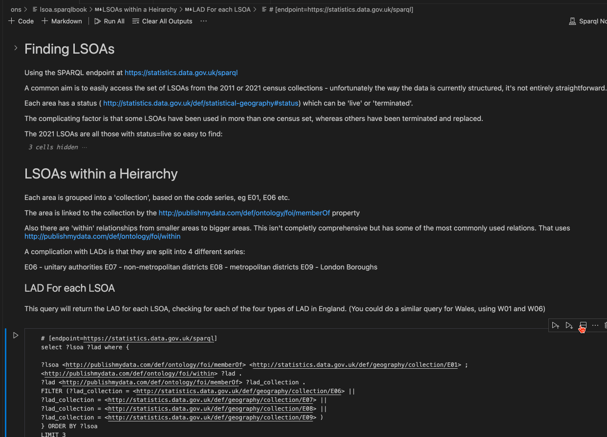

.sparqlbook files are best read using the [SPARQL Notebook](https://marketplace.visualstudio.com/items?itemName=Zazuko.sparql-notebook) extension in [VS Code](https://code.visualstudio.com/download): 

1. Download [VS Code](https://code.visualstudio.com/download)
2. Clone this repo: 

```bash
# copy the repo to your local machine
git clone https://github.com/Pathway-Analytics/sparql.git
# change directory
cd sparql
# open VS Code
code .
```
Then open the ons/lsoa.sparqlbook file and run some queries:
